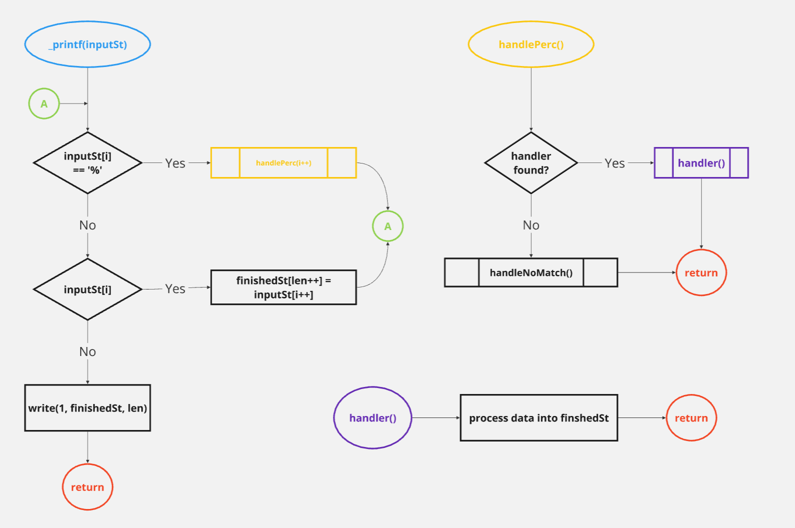

# _PRINTF(3) v0.1

## 24/07/2024

### NAME

`_printf` - variadic function that prints a formatted string to stdout


### SIGNATURE

**_printf (const char \*format, ...)**

### DESCRIPTION

`_printf` is a variadic function that takes in a format string, which can contain several format specifiers, that can then be replaced by variables in the output string. For example: `_printf("hello, %s", "world!");` will output 'hello world!' to stdout.

### PARAMETERS

- **Parameter 1**:
  The first parameter is always a string contained within double quotes:
    "Similar to this"

- **Other parameters**:
  `_printf()`, being a variadic function, can take as many parameters as the user needs. However, there have only been a few format specifiers implemented as of this version of `_printf()`.

### FORMAT SPECIFIERS

- **%s**: used for printing a string
  Example: `_printf("hi %s", str);`

- **%c**: used for printing a single char
  Example: `_printf("nice %c", char);`

- **%d** and **%i**: used for printing a decimal
  Examples: `_printf("the year is %d", int);` and `_printf("I'm %i years old", int);`

- **%%**: prints the % character once
  Example: `_printf("%%")` --> outputs %

## Usage

```c

# standard out: 'Hello World!'
_printf("Hello %s", "World!");

# standard out: 'E-Z'
_printf("E-%c", 'Z');

# standard out: 'I'm 31 years old'
_printf("I'm %d years old", 31);

# standard out: '99% of people don't know statistics!'
_printf("%i%% of people don't know statistics!", 99);

```

### RETURN VALUES

The function always returns an int corresponding to the length of the string that was sent to stdout.

### FLOWCHART



### AUTHOR

Juan Sebastian Aramburo <juansebastianaramburo@gmail.com>

## Installation

Download all of the .c files from the repo and #include them in your C project.

compile using GCC with the following flags:
````bash
$ gcc -o printf_968_0 -Wall -Werror -Wextra -pedantic -Wno-format -std=gnu89  *.c main.h
````

## Installation of man page

Follow these steps to install the man page for the `_printf` function from the file named `man_3_printf`:

````bash
$ sudo mv man_3_printf /usr/share/man/man3/_printf.3
````
````bash
$ sudo mandb
````
````bash
$ man 3 _printf
````
